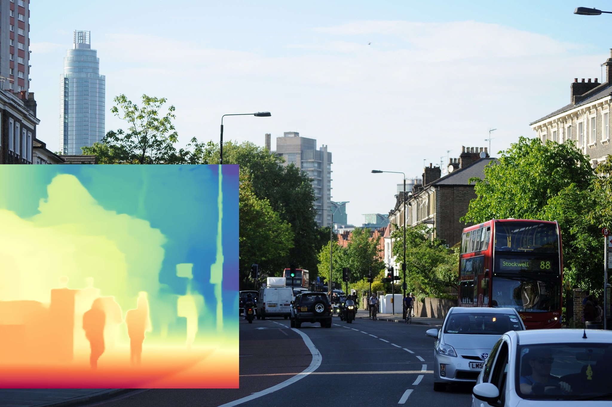

# Depth Anything V2 with ONNX and TensorRT

## Introduction

This repository is a simple implementation of Depth Anything V2 with ONNX and TensorRT. The model is converted from the original PyTorch model and can be used for image and video depth estimation.

## Installation
```bash
git clone https://github.com/DepthAnything/Depth-Anything-V2
```

```bash
pip install -r requirements.txt
```

TensorRT version:
- `torch==1.13.0+cu114`
- `torchvision==0.14.0+cu114`
- `pycuda==2022.2.2`
- `tensorrt==8.5.2.2`
- `JetPack 5.0`

## Convert model

### ONNX

Download the pre-trained model from [Depth-Anything-V2](https://github.com/DepthAnything/Depth-Anything-V2?tab=readme-ov-file#pre-trained-models) and put it under the `Depth-Anything-V2/checkpoints` directory.

```python
python export.py --encoder vits --input-size 518
```


### TensorRT
```python
python onnx2trt.py -o models/depth_anything_v2_vits.onnx --output depth_anything_v2_vits.engine --workspace 2
```


Or you can download the converted model from [Google Drive](https://drive.google.com/drive/folders/1ZxKDDyVEwETBtBV9jGF8-riMRVa2hzti?usp=drive_link) and put it under the `models` directory.

## Usage
```python
python infer.py --input-path assets/demo01.jpg --input-type image --mode onnx \
    --encoder vits --model_path models/depth_anything_v2_vits.onnx
```


Focus on a region with crop region:
```python
python infer.py --input-path assets/demo01.jpg --input-type image --mode onnx     --encoder vits --model_path depth_anything_v2_vits.onnx --crop-region "0 550 800 750"
```



Options:
- `--input-path`: path to input image
- `--input-type`: input type, `image` or `video`
- `--mode`: inference mode, `onnx` or `trt`
- `--encoder`: encoder type, `vits`, `vitb`, `vitl`, `vitg`
- `--model_path`: path to model file
- `--crop-region`: crop region, `x y w h`
- `--output-path`: path to output image
- `--grayscale`: output grayscale image

## TODO
- [ ] Add UI for easy usage with crop region
- [ ] Add motion blur detection
- [ ] Add depth map visualization when moving crop region

## Citation

```bibtex
@article{depth_anything_v2,
  title={Depth Anything V2},
  author={Yang, Lihe and Kang, Bingyi and Huang, Zilong and Zhao, Zhen and Xu, Xiaogang and Feng, Jiashi and Zhao, Hengshuang},
  journal={arXiv:2406.09414},
  year={2024}
}
```

Reference:
[Depth-Anythingv2-TensorRT-python](https://github.com/zhujiajian98/Depth-Anythingv2-TensorRT-python)
