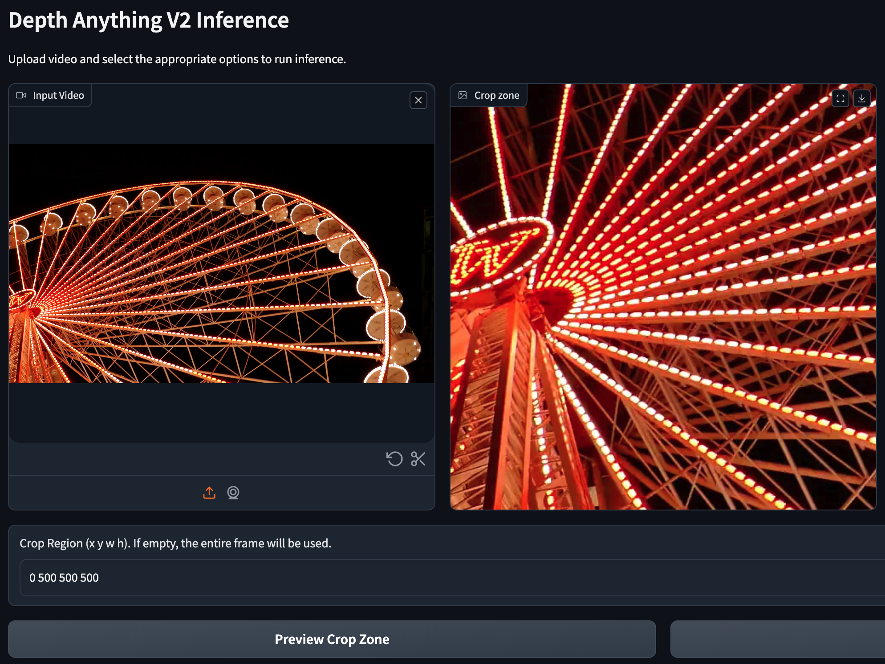
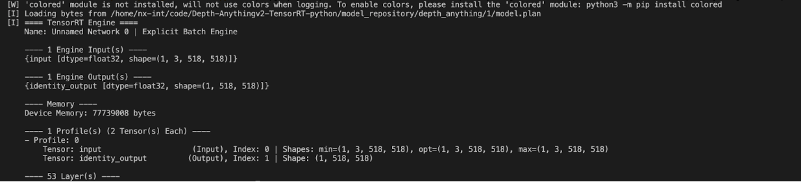
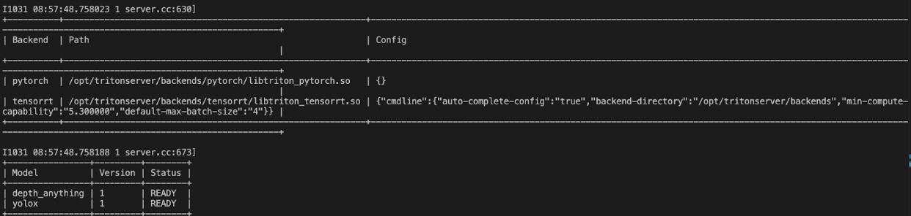
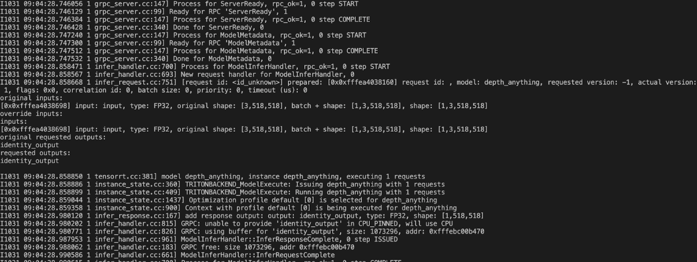

# Depth Anything V2 - ONNX and TensorRT Triton Inference Server

## Introduction

This repository is a simple implementation of Depth Anything V2 with ONNX and TensorRT. The model is converted from the original PyTorch model and can be used for image and video depth estimation.

## Installation
```bash
git clone https://github.com/DepthAnything/Depth-Anything-V2
```

```bash
pip install -r requirements.txt
```

TensorRT version:
- `torch==1.13.0+cu114`
- `torchvision==0.14.0+cu114`
- `pycuda==2022.2.2`
- `tensorrt==8.5.2.2`
- `JetPack 5.0`

## Convert model

### ONNX

Download the pre-trained model from [Depth-Anything-V2](https://github.com/DepthAnything/Depth-Anything-V2?tab=readme-ov-file#pre-trained-models) and put it under the `Depth-Anything-V2/checkpoints` directory.

```python
python export.py --encoder vits --input-size 518
```


### TensorRT
```python
python onnx2trt.py -o models/depth_anything_v2_vits.onnx --output depth_anything_v2_vits.engine --workspace 2
```


Or you can download the converted model from [Google Drive](https://drive.google.com/drive/folders/1ZxKDDyVEwETBtBV9jGF8-riMRVa2hzti?usp=drive_link) and put it under the `models` directory.

## Usage
```python
python infer.py 
  --input-path assets/demo01.jpg --input-type image \
  --mode onnx --encoder vits \
  --model_path models/depth_anything_v2_vits.onnx
```


Focus on a region with crop region:
```python
python infer.py 
  --input-path assets/demo01.jpg --input-type image \
  --mode onnx --encoder vits \ 
  --model_path depth_anything_v2_vits.onnx \
  --crop-region "0 550 800 750"
```


Options:
- `--input-path`: path to input image
- `--input-type`: input type, `image` or `video`
- `--mode`: inference mode, `onnx` or `trt`
- `--encoder`: encoder type, `vits`, `vitb`, `vitl`, `vitg`
- `--model_path`: path to model file
- `--crop-region`: crop region, `x y w h`
- `--output-path`: path to output image
- `--grayscale`: output grayscale image

## User Interface
```python
python app.py
```

URL: `http://127.0.0.1:7860`

- Preview crop zone


- UI with crop zone and the output depth map


## Deploy on Triton Inference Server

### Convert model to TensorRT plan and save it to the model repository

```bash
makedirs model_repository/depth_anything/1
trtexec --onnx=models/depth_anything_v2_vits.onnx --saveEngine=model_repository/depth_anything/1/model.plan
```

### Check I/O of model and create the model configuration

```bash
polygraphy inspect model model_repository/depth_anything/1/model.plan
```


Create `config.pbtxt` under the `model_repository/depth_anything` directory.

```bash
name: "depth_anything"
platform: "tensorrt_plan"
default_model_filename: "model.plan"
max_batch_size : 0
input [
  {
    name: "input"
    data_type: TYPE_FP32
    dims: [ 1, 3, 518, 518 ]
  }
]
output [
  {
    name: "output"
    data_type: TYPE_FP32
    dims: [ 1, 518, 518 ]
  }
]
```

### Build and run the Triton Inference Server container

- Edge devices with NVIDIA GPU

```bash
sudo docker build -t tritonserver:v1 .
sudo docker run --runtime=nvidia --gpus all -p 8000:8000 -p 8001:8001 -p 8002:8002
-v /home/nx-int/code/Depth-Anythingv2-TensorRT-python/model_repository:/models tritonserver:v1
```

- Server with NVIDIA GPU

```bash
sudo docker compose up --build
```



### Inference

```bash
python3 depth_anything_triton_infer.py --input-path assets/demo01.jpg
```



### Performance Benchmark

Inside the container, run the following command to benchmark the model:
```bash
perf_analyzer -m depth_anything --shape input:1,3,518,158 --percentile=95 --concurrency-range 1:4

or 
perf_analyzer -m depth_anything_dynamic --shape input:480,960,3 --percentile=95 --concurrency-range 1:4
```

## TODO

- [x] Add UI for easy usage with crop region
- [x] Deploy on Triton Inference Server

## Citation

```bibtex
@article{depth_anything_v2,
  title={Depth Anything V2},
  author={Yang, Lihe and Kang, Bingyi and Huang, Zilong and Zhao, Zhen and Xu, Xiaogang and Feng, Jiashi and Zhao, Hengshuang},
  journal={arXiv:2406.09414},
  year={2024}
}
```

Reference:
[Depth-Anythingv2-TensorRT-python](https://github.com/zhujiajian98/Depth-Anythingv2-TensorRT-python)
